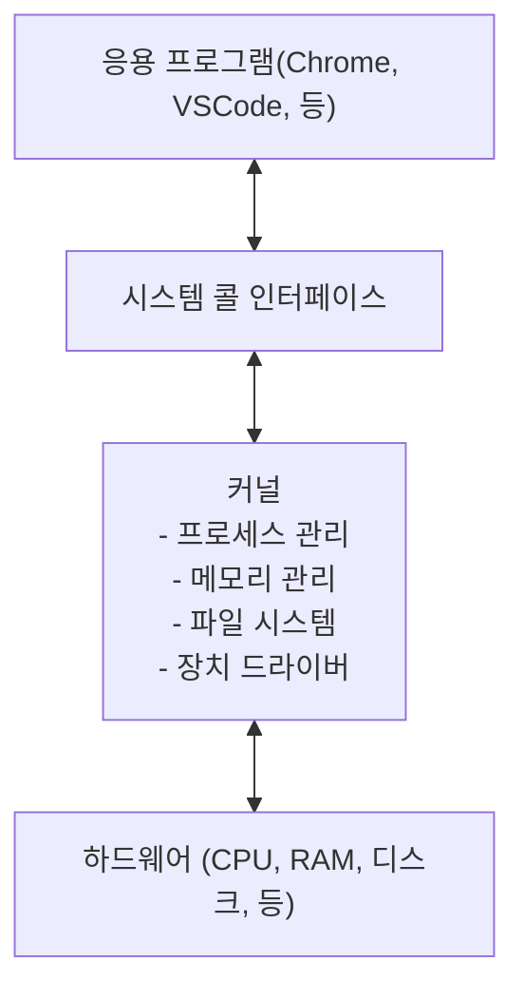
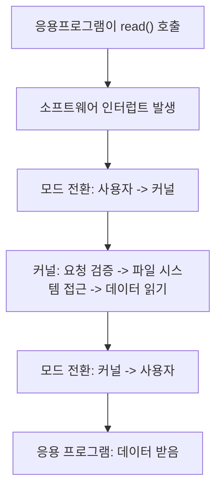

# 운영체제 

> 운영체제는 하드웨어와 소프트웨어 사이에서 중재자 역할을 하는 시스템 소프트웨어이다. 컴퓨터에서 가장 먼저 실행되어, 모든 프로그램이 동작할 수 있는 환경을 제공한다.

## 핵심역할
1. 자원 관리
	- CPU 시간을 여러 프로세스에 배분 (스케줄링)
	- 메모리 공간 할당 및 회수 (메모리 관리)
	- 디스크, 네트워크 등 I/O 장치 관리
2. 추상화 
	- 복잡한 하드웨어를 인터페이스로 감싼다.
	- 프로그래머가 디스크의 물리적인 구조를 몰라도 "파일"이라는 개념으로 데이터를 저장
3. 프로세스 관리
	- 프로그램 실행, 종료, 일시정지를 관리
	- 여러 프로그램이 동시에 실행되는 것처럼 보이게 한다 (멀티 태스킹)
4. 보안 및 보호
	- 프로세스 간 메모리 격리 (서로 다른 프로 그램이 메모리 접근 불가)
	- 사용자 권한 관리

## 핵심 용어 정리
### CPU 연산
CPU 연산은 프로세서가 직접 계산하는 작업이다. 산술 연산, 논리 연산, 데이터 이동 등 CPU가 메모리에서 데이터를 가져와서 계산하고 다시 저장하는 작업을 반복한다.

### I/O 연산
I/O연산은 CPU 외부 장치(디스크, 네트워크, 키보드 등)와 데이터를 주고받는 작업이다. CPU 입장에서는 외부 장치가 엄청 느리기 때문에 응답을 기다리는 시간이 발생하는데, 이 대기 시간동안 CPU가 다른 일을 할 수 있게 하는 것이 운영체제의 중요한 역할이다.

### 인터럽트
인터럽트는 CPU가 현재 작업을 중단하고 급한 일을 먼저 처리하게 하는 신호이다. CPU가 I/O 완료를 계속 확인해 가면서 기다리면 낭비가 심해진다. CPU는 본인 작업을 진행하다가 외부 장치가 인터럽트를 보내면 그때 해당 내용을 처리한다.
1. 인터럽트 발생
2. CPU가 현재 작업 상태 저장
3. 인터럽트 핸들러 실행
4. 원래 작업으로 복귀

### 사용자 모드 vs 커널 모드
CPU가 동작하는 권한 수준을 나눈 것이다. 하드웨어 레벨에서 지원하는 메커니즘이다.

#### 사용자 모드
- 일반 응용 프로그램이 실행되는 모드
- 제한된 명령어만 사용 가능
- 하드웨어 직접 접근 불가
- 다른 프로세스 메모리 접근 불가

#### 커널 모드
운영체제 커널이 실행되는 모드
모든 CPU 명령어 사용 가능
하드웨어 직접 제어 가능
모든 메모리 영역 접근 가능

### 시스템 콜
사용자 모드에서 실행 중인 프로그램이 커널의 서비스를 요청하는 인터페이스이다. 응용 프로그램은 사용자 모드라서 파일 읽기, 네트워크 통신, 프로세스 생성 같은 작업을 직접 할 수 없다. 운영체제에게 작업을 요청해야 하는데, 그 통로가 바로 시스템 콜이다.

대표적인 시스템 콜:
- 프로세스: `fork()`, `exec()`, `exit()`
- 파일: `open()`, `read()`, `wirte()`, `close()`
- 메모리: `mmap()`, `brk()`
- 네트워크: `socket()`, `connect()`, `send()`

## 프로세스 정의 및 주소 공간, 문맥

### 프로세스
> 프로세스는 실행 중인 프로그램이다.

프로그램은 디스크에 저장된 정적인 코드 파일인데, 이걸 실행하면 운영체제가 메모리에 코드를 올리고, CPU 시간을 할당하고, 필요한 자원을 부여해서 실체가 되는데 이를 프로세스라고 한다.

같은 프로그램을 여러 번 실행하면 별개의 프로세스가 여러개 생긴다. 예를 들어, 크롬 브라우저 창을 3개 열면 프로그램은 하나지만 프로세스는 3개가 된다.

프로세스가 가지는 것들:
1. 고유한 프로세스 ID(PID)
2. 독립된 메모리 공간(주소 공간)
3. 실행 상태 정보(Context)
4. 열린 파일, 네트워크 연결 등 자원

### 주소 공간
주소 공간은 프로세스가 사용할 수 있는 독립된 메모리 영역이다. 각 프로세스는 자신만의 주소 공간을 가지고, 다른 프로세스의 주소 공간에 접근할 수 없다.

각 영역 설명:
- 텍스트(Code): 실행할 기계어 명령어이다. Read Only로 수정이 불가하다.
- 데이터(Data): 전역 변수, static 변수가 담기는 공간
- 힙(Heap): `malloc()`, `new` 등으로 런타임에 동적으로 할당되는 영역이다.
- 스택(Stack): 함수 호출 시 지역변수, 매개변수, 복귀 주소, 등을 저장한다. 함수가 끝나면 자동으로 해제된다.

실제로 각 프로세스는 가상 주소를 사용하는데, 프로세스 A의 주소 0x1000과 프로세스 B의 주소 0x1000은 물리적으로 다른 위치를 가리킨다. 운영체제와 하드웨어(MMU)가 가상 주소를 물리주소로 변환해줘서 프로세스 간 격리가 보장된다.

### 문맥: Context
문맥은 프로세스의 현재 실행 상태를 나타내는 모든 정보이다. 프로세스를 잠시 멈췄다가 나중에 이어서 실행하려면 이 정보가 필요하다.
문맥의 구성 요소:
1. CPU 문맥
	- 프로그램 카운터(PC): 다음에 실행할 명령어 주소
	- 레지스터 값: 연산 중간 결과, 스택, 포인터, 등
	- 상태 레지스터: CPU 플래그
2. 메모리 문맥
	- 주소 공간 정보(코드, 데이터, 힘, 스택 위치)
	- 페이지 테이블(가상 -> 물리 주소 매핑)
3. 커널 문맥
	- 프로세스 상태(실행, 대기, 준비 등)
	- PID, 우선 순위
	- 열린 파일 목록
	- 시그널 정보
	- 계정 정보(CPU 사용 시간)

위 정보들은 커널이 PCB(Process Control Block)이라는 자료구조에 저장해서 관리한다.

CPU가 여러 프로세스를 실행하고 전환하는 과정에서 Context Switch라는 것이 발생하는데, 너무 자주 일어나면 비효율 적이지만, 한편으로 너무 안일어나면 다른 프로세스가 기다리는 시간들이 길어진다. 따라서 이 균형을 잡는게 스케줄링의 핵심 과제이다.

## 큐와 스케줄러
### 큐
운영체제는 프로세스들을 관리하고 스케줄링을 하기 위한 큐를 두고 있는데, 이를 프로세스 큐(Process Queue)라고 한다.
1. Job Queue(작업 큐)
	- 시스템에 들어온 모든 프로세스가 머무는 큐
	- 아직 메모리에 올라가지 않은 프로세스들 포함
2. Ready Queue(준비 큐)
	- 메모리에 올라와서 CPU 할당을 기다리는 프로세스들
	- 여기서 다음에 실행할 프로세스를 고르는 것이 CPU 스케줄링이다.
3. Device Queue(장치 큐)
	- I/O 장치별로 존재한다
	- 해당 장치 사용을 기다리는 프로세스들

### 스케줄러
어떤 프로세스에게 자원을 줄지 결정하는 운영체제 구성요소이다. 결정하는 시점과 대상에 따라 크게 세가지로 나뉜다.
1. 장기 스케줄러
	- 디스크에 있는 프로세스(Job Queue) 중 어떤 프로세스를 메모리에 로드할지 결정한다.
	- 메모리 내 프로세스 수를 적절하게 조절하여 과부하를 방지한다.
2. 중기 스케줄러
	- 실행 중인 프로세스를 메모리에서 디스크로 이동하거나, 디스크에서 메모리로 복구한다.
	- 메모리 부족 시 우선순위가 낮은 프로세스를 suspended 상태로 전환한다.
3. 단기 스케줄러
	- Ready Queue에 있는 프로세스 중 CPU를 할당 받아 실행할 프로세스를 선택함
	- CPU의 효율적인 사용을 위해 빈번히 작동한다.

## PCB
PCB는 프로세스에 대한 모든 정보를 저장하는 커널 자료구조이다. 프로세스 하나당 하나의 PCB가 생성되고 커널 메모리 영역에 저장된다. PCB를 통해 프로세스에 대한 모든 정보를 관리한다.

1. 프로세스 식별 정보
	- PID: 프로세스 고유 번호
	- PPID: 부모 프로세스 번호
	- UID: 프로세스 소유자
2. 프로세스 상태 정보
	- 현재 상태
	- 우선 순위
3. CPU 문맥
	- 프로그램 카운터(PC)
	- 스택 포인터(SP)
	- 범용 레지스터 값
	- 상태 레지스터
4. 메모리 관리 정보
	- 프로세스의 코드, 데이터, 스택의 주소 정보
5. I/O 파일 및 정보
	- 어떤 파일을 읽고 있는지
6. 계정 정보
	- 프로세스 시작 시간
	- CPU 사용 시간

## 스레드
스래드는 프로세스 내에서 실행되는 흐름의 단위이다. 하나의 프로세스는 최소 하나의 스레드를 가지고, 여러개의 스레드를 가질 수도 있다. 프로세스가 실행중인 프로그램이라면 스레드는 그 안에서 실제로 일하는 일꾼이다. 스레드를 사용하는 이유는 다음과 같다.

1. 자원 효율성 : 프로세스를 새로 만들면 메모리 공간을 통째로 복사해야 하는데, 스레드는 기존 프로세스의 자원을 공유하기 때문에 생성 비용이 싸다
2. 빠른 문맥교환 : 프로세스 간 문맥 교환은 주소 공간 전환이 필요해서 무거운데, 같은 프로세스 내 스레드 간 전환은 주소공간이 같으니까 훨씬 가볍다.
3. 프로세스 간 통신(IPC)은 파이프, 소켓, 공유 메모리 등 별도 메커니즘이 필요하다. 스레드는 힘과 데이터 영역을 공유하기 때문에 변수로 데이터를 주고 받을 수 있다.
4. 응답성 향상 : 예를 들어, 웹 브라우저에서 한 스레드가 이미지를 다운로드하는 동안 다른 스레드가 사용자 입력을 처리할 수 있다.

스레드의 단점:
1. 동기화 문제 : 여러 스레드가 같은 데이터에 접근하면 Race Condition이 발생할 수 있다.
2. 한 스레드에서 심각한 오류가 나면 프로세스 전체가 죽을 수 있다.
3. 디버깅 어려움 : 실행 순서가 비결정적이라 버그 재현이 어렵다.

## 멀티 프로세스, 멀티 스레드 

### 멀티 프로세스
장점: 
- 프로세스 간 메모리가 격리되어 있어서 하나가 죽어도 다른 프로세스에 영향을 주지 않는다.
- 프로세스 간 직접 메모리 접근 불가
- 각 프로세스가 완전히 독립적으로 동작한다.

단점:
- 프로세스마다 독립적인 메모리 공간이 필요해 자원이 많이 든다.
- fork 시 메모리 복사 등 오버헤드가 크다
- IPC 메커니즘 구현이 필요하다
- 문맥 교환 시 주소 공간 전환으로 인해 무겁다.

적합한 경우:
- 안정성이 중요한 서비스(웹 브라우저 탭, DB)
- CPU bound 작업의 병렬 처리
- 서로 다른 권한이 필요한 작업
- Python에서 병렬 처리가 필요할 때

### 멀티 스레드
장점:
- 메모리 공유로 자원 효율적이다.
- 스택만 새로 할당하면 되서 빠르다.
- 공유 메모리로 즉시 데이터 교환 가능하다.
- 주소 공간 전환이 불필요하다
- 한 스레드가 I/O 대기해도 다른 스레드가 작업 가능하다

단점:
- 동기화 필수 공유 자원 접근 시 락 필요
- 한 스레드의 오류가 전체 프로세스 영향
- 설계가 복잡하다.

적합한 경우:
- I/O bound 작업(네트워크 요청, 파일 처리)
- GUI 애플리케이션
- 빈번한 데이터 공유가 필요한 작업

## CPU 스케줄링 알고리즘과 성능 척도
### 성능 척도
1. CPU 이용률 : CPU가 실제로 일하는 시간의 비율
2. 처리량 : 단위 시간당 완료되는 프로세스 수
3. 대기 시간 : Ready Queue에서 기다린 총 시간
4. 반환 시간 : 도착 -> 완료까지 걸린 총 시간
5. 응답 시간 : 도착 -> 첫 실행까지 걸린 시간

### CPU 스케줄링 알고리즘
1. FCFS : 먼저 도착한 순서대로 처리하는 비선점형(한번 실행되면 끝까지 실행) 알고리즘이다. 구현이 단순하지만, 긴 프로세스가 먼저 오면 짧은 프로세스들은 소요시간과 상관없이 오래 대기해야한다.
2. SJF : 실행 시간이 짧은 프로세스부터 처리하는 방식이고, 비선점형이다. 평균 대기시간이 최소화되지만 긴 프로세스는 계속해서 밀릴 수 있다.
3. SRTF : SJF의 선점형 버전이다. 남은시간이 가장 짧은 프로세스 부터 실행하는 방식이다. SJF보다 평균 대기시간이 더 짧지만 Conetxt 스위칭이 자주 일어나고 Starvation 문제는 여전히 존재한다.
4. Priority Scheduling : 우선 순위가 높은 프로세스부터 처리하는 방식이다. 선점형/비선점형 모두 가능한 방식이다. 우선 순위가 낮은 프로세스는 영원히 대기할수도 있다. 이에 따라 대기 시간이 길어질수록 우선순위를 높이는 방식으로 해결할 수 있다.
5. RR : 시간 할당량 만큼 돌아가면서 실행하는 방식이다. 할당 시간이 끝나면 강제로 다음 프로세스로 교체된다. 모든 프로세스가 공정하게 돈다는 장점이 있지만 시간 할당량에 따라 잦은 context 스위칭으로 인한 오버헤드 증가가 발생하거나(시간 할당량 적음), 너무 많으면 FCFS와 비슷해진다.