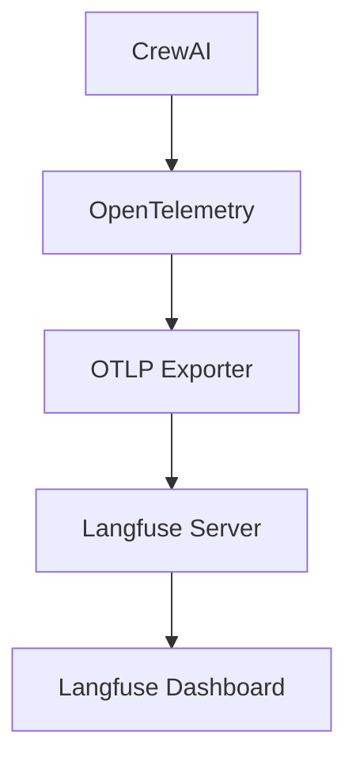

팀 프로젝트에서 CrewAI를 사용하고 어느정도 개발이 진행된 시점에서 비용 비교와 모델 선정에 있어서 CLI에서는 한계를 느끼고 여러 메트릭들을 시각화하는 과정이 필요해졌다. 

# CrewAI 공식 문서에 있는 Observability
## 1. Langfuse
#### 장점
- 오픈 소스 + 셀프호스팅으로 비용 절감이 가능하고 커스터마이징이 가능하다.
- 토큰 사용량, API 비용 계산, 프로젝트별 비용 분석이 가능하다.
#### 단점
- 다른 도구에 비해 신생 툴이라 자료가 적다.
- 일부 고급 기능들은 클라우드 버전에만 제공된다.


## 2. LangSmith
#### 장점
- LangChain 생태계 최적화 되어 있다.
- 체인 시각화가 우수하다.
#### 단점
- 클라우드 전용이다.
- 비용이 발생한다. (무료티어 존재)


## 3. Arize Phoenix
#### 장점
- 오픈소스이고 상업적 사용도 제한이 없다.
- RAG 특화된 기능이 존재한다.(임베딩 시각화)
#### 단점
- CrewAI는 수동 계측이 필요하다.
- 비용 추적 기능이 부족하다.


## 4. Datadog  
#### 장점
- 알림/온콜 시스템
- 다른 인프라 모니터링과 통합이 가능하다.
#### 단점
- LLM 특화 기능이 없다.
- 비용이 저렴하지 않다.


## Langfuse를 선택한 이유
Phase -> Task -> Agent 로 가는 계층 구조로 에이전트 별 추적이 가능해야하고, 토큰 및 비용 측정이 가능한 observability 중에 무료인 Langfuse를 선택하게 되었습니다.


---
# Langfuse + crewAI 세팅

[공식 문서](https://docs.crewai.com/ko/observability/langfuse)에서는 OpenLit과 OpenTelemetry를 통해 CrewAI와 Langfuse를 통합하는 방식을 소개 한다. crewai 에서 일어나는 작업을 OpenTelemetry에서 자동으로 데이터를 기록하고 OTLP Exporter가 Langfuse 서버로 데이터를 전송해주는 방식이다.


crewai 에서 실제 작업이 일어나고 OpenTelemetry에서 자동으로 데이터를 기록하고 OTLP Exporter가 랭퓨즈 서버로 데이터를 전송해주는 방식이다.


## 문제 1: Trace가 flat하게 나열되어 Phase 구분이 되지 않는다.

#### 증상
랭그래프와 다르게 Task별로 결과가 쪼개져서 나온다. 이는 OpenTelemetry의 Instrumentation의 작동 방식 때문인데, `crew.kickoff()`가  실행되면 각 Task 별로 Span을 생성하기 때문에 랭그래프처럼 flow가 통합되어서 로그가 쌓이지 않는다. 이는 OpenTelemetry가 API 호출만 추적하기 때문인데, Task간의 관계를 파악하지 못하지 못하니 langfuse로 결과를 보는 것이 불편해지는 문제가 발생했다.
 
```text 
crew.kickoff()
    ↓
Task 1 실행
    ↓
agent.execute_task()
    ↓
llm.chat()  ← OpenTelemetry가 여기를 감지!
    ↓
OpenAI API 호출 → Span 생성 (독립적)
    ↓
Task 2 실행
    ↓
agent.execute_task()
    ↓
llm.chat()  ← 또 감지!
    ↓
OpenAI API 호출 → 새로운 Span 생성 (독립적)
```


#### 원인
기존 구현은 Crew.kickoff() 한번에 모든 Task를 실행했다. OpenInference instrumentor는 각 Task/LLM 호출마다 span을 생성하지만, 모두 동일한 부모 sapn 아래로 생성되기 때문에, 동일한 depth로 배치된다.

#### 해결
Phase 별로 별도의 Crew를 생성하고 각 Phase를 `langfuse.start_as_current_observatioin()`으로 감쌌다. 각 Phase 내부 에이전트를 순차 실행을 강제해 계층구조를 만들어주면서 발생하는 crew간 컨텍스트 상실은 `_inject_context()`로 이전 Phase의 출력을 desription에 주입시켰다.


---
L4 GPU 인스턴스 생성부터 vLLM 엔진 가동, 그리고 LiteLLM 프록시 연결까지 정말 험난한 과정을 잘 통과하셨습니다! 나중에 같은 문제가 생겼을 때 빠르게 해결하실 수 있도록, 오늘 우리가 함께 해결한 **[L4 GPU + vLLM + LiteLLM 구축 트러블슈팅 가이드]**를 정리해 드립니다.

---

## 🚀 L4 GPU 기반 AI 서빙 환경 트러블슈팅 리포트

### 1. 인스턴스 초기 설정 및 GPU 인식 문제

- **문제**: GPU 드라이버 설치 및 인식 실패.
    
- **원인**: 일반 OS 이미지 사용 시 드라이버 및 CUDA 수동 설치 중 버전 꼬임 발생.
    
- **해결**: GCP의 **Deep Learning VM 이미지**를 사용하여 드라이버 자동 설치 옵션 선택. `nvidia-smi` 명령어로 인지 확인 완료.
    

### 2. 네트워크 접속 및 방화벽 문제

- **문제**: 외부(내 PC)에서 서버 API(4000/8000 포트) 접속 시 `ERR_CONNECTION_REFUSED` 발생.
    
- **원인**: GCP 기본 방화벽 규칙에서 해당 포트가 닫혀 있음.
    
- **해결**: GCP 콘솔 [VPC 네트워크] -> [방화벽]에서 **TCP 4000(LiteLLM)** 및 **8000(vLLM)** 인바운드 포트 개방 규칙 추가.
    

---

### 3. LiteLLM 실행 및 의존성 문제 (가장 험난했던 구간)

- **문제 1**: `ModuleNotFoundError: No module named 'backoff'`.
    
    - **해결**: `pip install 'litellm[proxy]'` 명령어를 통해 프록시 전용 부가 패키지 전체 설치.
        
- **문제 2**: `Authentication Error, Not connected to DB! / Prisma Error`.
    
    - **원인**: LiteLLM 최신 버전이 관리 UI 구동을 위해 DB(Prisma)를 강제로 요구함. 깡통 서버 환경에서 Prisma 바이너리 호환성 및 스키마 경로 인식 오류 발생.
        
    - **해결 (최종)**: DB와 UI 기능을 아예 사용하지 않도록 `litellm_config.yaml`에서 `ui_access_mode: "none"` 또는 `database_type: "none"` 설정을 하거나, 환경 변수(`unset DATABASE_URL`)를 초기화하여 **API 전용 프록시 모드**로 구동.
        

---

### 4. 모델 구동 및 VRAM 관리 (vLLM)

- **문제**: 모델 크기와 GPU VRAM 용량 불일치 우려.
    
- **상황**: L4 GPU(24GB VRAM) 한 장에 Qwen2.5-14B(약 28GB) 로드 시도.
    
- **해결**: 모델을 **Qwen2.5-7B-Instruct**로 변경하여 양자화 없이 원본 성능(BF16)으로 넉넉하게 서빙 성공.
    
    - vLLM 실행 시 `--tensor-parallel-size 1` 및 `--max-model-len 32768` 옵션 최적화.
        

---

### 5. 클라이언트(내 PC) 연결 및 요청 오류

- **문제 1**: `openai.BadRequestError: Invalid model name`.
    
    - **원인**: 모델 이름 앞에 불필요한 접두어(`openai/`)를 붙여 LiteLLM 설정값과 불일치 발생.
        
    - **해결**: `--model qwen-7b-local`로 설정 파일에 명시된 **별칭(Alias)**만 사용하도록 수정.
        
- **문제 2**: `ModuleNotFoundError: No module named 'apscheduler'` (Mac 로컬).
    
    - **해결**: 로컬 PC 환경에도 `pip install 'litellm[proxy]'`를 설치하여 클라이언트 측 의존성 해결.
        

---

### 🛠️ 최종 성공 구성 요약

|**구성 요소**|**설정값**|
|---|---|
|**GPU**|NVIDIA L4 (24GB VRAM)|
|**모델 (vLLM)**|Qwen/Qwen2.5-7B-Instruct (Port: 8000)|
|**프록시 (LiteLLM)**|별칭: `qwen-7b-local` (Port: 4000)|
|**API Key / Base URL**|`sk-1234` / `http://[SERVER_IP]:4000/v1`|

이제 이 문서를 바탕으로 다음 번엔 10분 만에 세팅을 끝내실 수 있을 거예요!

혹시 이 트러블슈팅 내용을 바탕으로 **실제 CrewAI 자동화 코드(예: 'damo' 마스코트 생성용 프롬프트 에이전트)**를 작성해 볼까요? 원하시는 다음 단계가 있다면 말씀해 주세요!